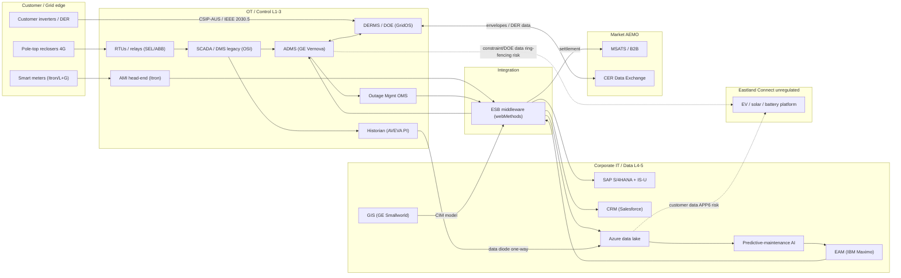
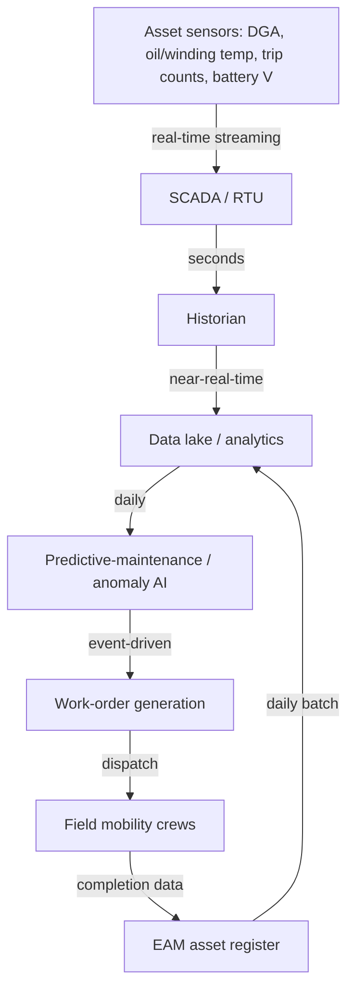
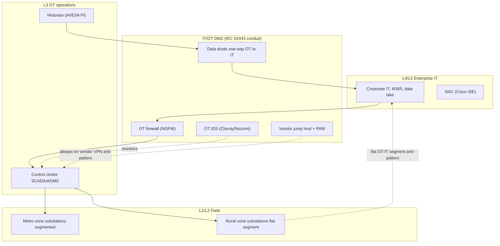

# Architecture & Data-Flow Diagrams — Eastland Energy Networks (Fixture A, Track B)

**Entity:** Eastland Energy Networks Pty Ltd
**Artefact type:** Reference architecture + data-flow diagrams (synthetic) — Track-B discovery evidence for `au-energy`.
**Scope:** Asset-management & key OT/IT systems landscape — **data, frequency, and downstream systems**.

> ⚠️ **SYNTHETIC COMPOSITE — TEST FIXTURE ONLY.** These are fabricated, illustrative diagrams for `au-energy` validation — **not** any real network's architecture. They are drawn *using public reference architectures as structural method* (SGAM; AEMO CER Data Exchange High-Level Design; CSIP-AUS; AEMO + Energy Networks Australia "Open Energy Networks") — no proprietary DNSP diagram is reproduced. See [`../../REFERENCES_AND_METHODOLOGY.md`](../../REFERENCES_AND_METHODOLOGY.md) and [`../../INTERNATIONAL_DATA_SOURCES.md`](../../INTERNATIONAL_DATA_SOURCES.md).

---

## 1. System / integration landscape (OT ↔ IT ↔ Market ↔ Customer)

Shows the convergence seam and the two ring-fencing/privacy leakage paths to the unregulated arm. *(Validated — renders as a Mermaid flowchart.)*

## 2. Asset-management data flow (with frequency)

From sensor to work order — the data path behind the pseudo asset inventory.

## 3. OT network zones (Purdue) with anti-patterns

## 4. Asset-management data register — data, frequency, downstream systems

| data domain | source system | frequency | downstream systems | classification / note |
|-------------|---------------|-----------|--------------------|-----------------------|
| SCADA telemetry (status, analogs) | RTU → SCADA/ADMS | Real-time (sub-second–seconds) | Historian, ADMS, DERMS | OT-critical; basis for control |
| Transformer condition (DGA, temp) | Substation sensors → historian | Periodic + event | Data lake, predictive-maintenance AI, EAM | Asset-health; feeds WO |
| Protection events (trips, settings) | Relays/IEDs → SCADA | Event-driven | ADMS, historian, EAM | Safety-critical |
| Smart-meter data | Meters → AMI head-end → MDM | Interval (e.g. 5–30 min) + daily | Billing, settlement (MSATS), data lake, LV analytics | Customer PII; market + OT use |
| DER / envelope data | Inverters ↔ DERMS (CSIP-AUS) ↔ CER Data Exchange | Near-real-time | DERMS, AEMO CER, network ops | Customer + market; integrity-critical |
| Network model (assets, topology) | GIS (CIM) | Daily/weekly publish | ADMS, DERMS, EAM | Master data |
| Asset register & maintenance | EAM | Batch (daily) | Data lake, SAP, work mgmt | Asset lifecycle |
| Outage data | OMS | Event-driven | CRM/portal, customer comms, regulator reporting | Customer-facing |
| Analytics / AI features | Data lake | Daily/continuous | Predictive-maintenance AI, DER forecasting | OT→IT egress (governance concern) |

## 5. What these feed in the assessment

- **AESCSF CA** (architecture, segmentation, OT→IT egress), **SA** (where monitoring sits), **ACM** (master data flows), **EDM** (vendor access path).
- **SOCI** cyber-hazard (segmentation), physical (control centre), supply-chain (jump host); dependency mapping for material risk.
- **AER ring-fencing** — the two dotted leakage paths to Eastland Connect.
- **Provenance:** structural method = SGAM + AEMO CER Data Exchange HLD + CSIP-AUS + Open Energy Networks (see references doc).
